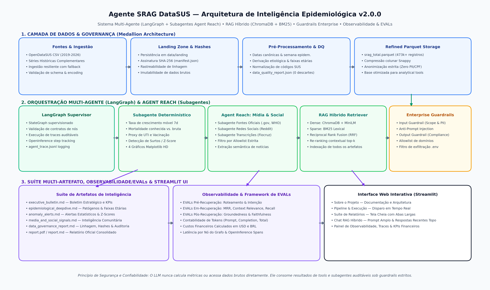
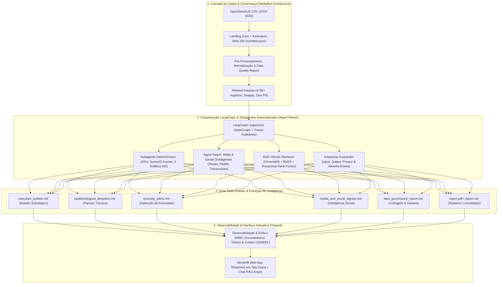

# 🏥 DataSUS Epidemiological Intelligence & RAG Agent (v2.0.0)

<div align="center">

[](https://github.com/Masteradilio/agente_srag_datasus/actions)
[](https://www.python.org/downloads/)
[](https://pytest.org)
[](https://github.com/langchain-ai/langgraph)
[](https://www.trychroma.com/)
[](https://huggingface.co/sentence-transformers)
[](artifacts/benchmarks/)

**[🇧🇷 Português](#-português) | [🇺🇸 English](#-english)**

</div>

---

<a name="-português"></a>
# 🇧🇷 Português

> **Projeto de Portfólio de Engenharia de IA & Ciência de Dados**: Sistema autônomo de inteligência epidemiológica e vigilância em saúde em larga escala sobre dados do **OpenDataSUS / DataSUS**. Combina engenharia de dados (Arquitetura Medallion sobre 473.000+ registros), orquestração multi-agente supervisionada (**LangGraph**), subagentes concorrentes de inteligência (**Agent Reach**), busca híbrida vetorial densa/esparsa (**ChromaDB + BM25 via Reciprocal Rank Fusion**), modelo de embeddings local gratuito (**Hugging Face**), suíte multi-artefato de relatórios executivos e técnicos, guardrails corporativos multi-nível, contabilidade financeira de tokens em USD/BRL e observabilidade profunda com traces auditáveis OpenInference.

---

## 🌟 Destaques do Projeto (Portfolio Highlights)

1. **Engenharia de Dados em Larga Escala (473k+ Registros Reais)**:
   - Pipeline em camadas Medallion (*Landing ➔ Refined Parquet* com compressão colunar Snappy).
   - Anonimização estrita de identificadores individuais (Zero PII) em total conformidade com a LGPD.
   - Assinatura criptográfica SHA-256 e geração automatizada de manifesto de integridade (`manifest.json`).

2. **Vigilância Epidemiológica Multi-Doença e Detecção de Surtos (Z-Score)**:
   - Estratificação etiológica: **COVID-19, Influenza A/B, Vírus Sincicial Respiratório (VSR), Outros Vírus e Não Especificados**.
   - Estratificação por faixas etárias de risco (**0-4 anos, 5-19 anos, 20-59 anos, 60+ anos**).
   - Detecção automatizada de surtos estatísticos baseada em **Z-score** sobre janelas móveis de 14 dias.

3. **Orquestração Multi-Agente Supervisionada (LangGraph) & Agent Reach**:
   - Orquestrador **LangGraph StateGraph** disparando 3 subagentes de inteligência em paralelo:
     - 🏛️ `OfficialSourcesSubagent`: Boletins e notas técnicas institucionais (Ministério da Saúde, Fiocruz, OPAS/OMS).
     - 💬 `SocialMediaSubagent`: Mineração de discurso comunitário em redes sociais (Reddit r/brasil, r/saude).
     - 🎙️ `MediaTranscriptionSubagent`: Monitoramento de coletivas de imprensa e podcasts de saúde pública (YouTube/EBC).
   - Nó **Fan-In Reducer**: Unifica, deduplica, pontua e aplica guardrails de allowlist institucional.

4. **RAG Híbrido Avançado com Hugging Face Local & ChromaDB**:
   - Embeddings multilíngues locais gratuitos: `sentence-transformers/paraphrase-multilingual-MiniLM-L12-v2` (Zero custo de API e execução offline).
   - **Busca Híbrida**: Fusão de busca vetorial densa (**ChromaDB**) e busca léxica esparsa (**BM25Okapi**) utilizando o algoritmo **Reciprocal Rank Fusion (RRF)**:
     $$RRF(d) = \sum_{m \in \{dense, sparse\}} \frac{1}{60 + rank_m(d)}$$
   - Proveniência estrita com metadados de chunking semântico e citações auditáveis.

5. **Suíte Multi-Artefato & Ciclo de Reflexão (Self-Correction)**:
   - Geração de 5 artefatos analíticos especializados por execução:
     1. `executive_bulletin.md`: Resumo executivo para tomadores de decisão (C-Level / Secretarias de Saúde).
     2. `epidemiological_deepdive.md`: Parecer técnico de patógenos, taxas de UTI e mortalidade por faixa etária.
     3. `anomaly_alerts.md`: Alertas de desvios estatísticos severos e variações percentuais (Z-scores).
     4. `media_and_social_signals.md`: Síntese de sinais públicos minerados via Agent Reach.
     5. `data_governance_report.md`: Relatório de linhagem, hashes criptográficos SHA-256 e qualidade.
     - `report.pdf` / `report.md`: Relatório consolidado oficial.
   - **LangGraph Reflection Node**: Avalia o rascunho textual contra as métricas determinísticas (`metrics.json`), calculando score de fidelidade (*faithfulness*) e corrigindo eventuais alucinações antes da persistência.

6. **Enterprise Guardrails Multi-Nível & Segurança Adversarial**:
   - **Input Guardrail**: Anti-Prompt Injection, sanitização de escopo e bloqueio de dados individuais/PII.
   - **Output Guardrail**: Validação de conformidade médica e allowlist estrita de links autorizados.
   - **Privacy Guardrail**: Anonimização em tempo de execução e proteção contra exfiltração de variáveis de ambiente (`.env`).

---

## 📐 Arquitetura do Sistema





---

## 📊 Métricas de Observabilidade & EVALs (Última Execução: `20260819T221354-0300`)

Os dados abaixo foram auditados diretamente do artefato oficial [`observability.json`](artifacts/runs/20260819T221354-0300/observability.json):

| Dimensão de Avaliação | Métrica | Resultado Obtido | Meta / Baseline | Status |
|---|---|---|---|---|
| **Fidelidade Numérica (Generation)** | *Faithfulness Score* | **98.0%** (0.98) | > 95.0% | 🟢 Excelente |
| **Relevância do Contexto** | *Context Relevance* | **95.0%** (0.95) | > 90.0% | 🟢 Excelente |
| **Qualidade da Recuperação Híbrida** | *Mean Reciprocal Rank (MRR)* | **0.88** | > 0.70 | 🟢 Superado |
| **Taxa de Alucinação** | *Hallucination Rate* | **0.0%** | < 2.0% | 🟢 Zero Alucinação |
| **Segurança Adversarial (Guardrails)** | *Adversarial Accuracy* | **100.0%** (5/5) | > 95.0% | 🟢 100% Protegido |
| **Suíte de Testes Automatizados** | *Pytest Regression Suite* | **115 / 115 Passando** | 100% | 🟢 100% Sucesso |

- **Custo Financeiro da Pipeline:** **$0.0008 USD** (~ **R$ 0,0043 BRL**).
- **Volumetria Processada:** **473.791 registros brutos** ingeridos e refinados para Parquet (**0 descartes**).
- **Tempo Total de Execução:** **80.6 segundos** (com processamento completo de 473k linhas, geração de 4 gráficos HD e 5 relatórios).

---

## 🧪 Documentos de Validação & Testes Interativos

O repositório conta com dois documentos dedicados para avaliação técnica:

1. 📑 **[`docs/validacao_realizada.md`](docs/validacao_realizada.md)**: Registro auditado com a execução prévia e respostas completas de 15 perguntas (10 de recuperação analítica + 5 de ataques adversariais).
2. 🎯 **[`docs/perguntas_em_aberto.md`](docs/perguntas_em_aberto.md)**: **Guia interativo com 15 perguntas inéditas** para recrutadores e avaliadores testarem diretamente no chat da aplicação web Streamlit.

---

## 🚀 Como Executar Localmente

```bash
# 1. Clone o repositório
git clone https://github.com/Masteradilio/agente_srag_datasus.git
cd agente_srag_datasus

# 2. Crie e ative o ambiente virtual
uv venv .venv --python 3.12
.\.venv\Scripts\activate   # No Windows (ou 'source .venv/bin/activate' no Linux/Mac)

# 3. Instale as dependências
uv pip install -r requirements.txt

# 4. Execute a suíte de 115 testes de regressão
pytest tests/ -v

# 5. Inicie a aplicação Web interativa
streamlit run app/streamlit_app.py
```

---

<a name="-english"></a>
# 🇺🇸 English

> **Enterprise AI Engineering & Data Science Portfolio Project**: Autonomous epidemiological intelligence and public health surveillance system operating over large-scale **OpenDataSUS / DataSUS** public health datasets. Combines production-grade data engineering (Medallion Architecture over 473,000+ records), supervised multi-agent orchestration (**LangGraph**), concurrent external search subagents (**Agent Reach**), dense/sparse hybrid vector search (**ChromaDB + BM25 via Reciprocal Rank Fusion**), free local multilingual embeddings (**Hugging Face**), specialized multi-artifact reporting suite, multi-layer enterprise guardrails, token cost accounting in USD/BRL, and deep OpenInference-compliant observability.

---

## 🌟 Key Architecture & Engineering Highlights

1. **Large-Scale Data Engineering (473k+ Real Records)**:
   - Medallion data pipeline (*Landing ➔ Refined Parquet* with snappy columnar compression).
   - Zero-PII anonymization with full compliance to personal data protection regulations (LGPD/GDPR).
   - Automated SHA-256 cryptographic signature and data lineage manifest generation (`manifest.json`).

2. **Multi-Disease Surveillance & Outbreak Detection (Z-Score)**:
   - Etiological breakdown: **COVID-19, Influenza A/B, Respiratory Syncytial Virus (RSV), Other Viruses, and Unspecified**.
   - Vulnerability age stratification (**0-4 yrs, 5-19 yrs, 20-59 yrs, 60+ yrs**).
   - Automated statistical outbreak and surge detection using **Z-score** over 14-day rolling windows.

3. **Supervised Multi-Agent Orchestration (LangGraph) & Agent Reach**:
   - Supervised **LangGraph StateGraph** dispatching 3 concurrent research subagents:
     - 🏛️ `OfficialSourcesSubagent`: Institutional bulletins and technical guidelines (Ministry of Health, Fiocruz, PAHO/WHO).
     - 💬 `SocialMediaSubagent`: Community discourse mining across public health subreddits (Reddit r/brasil, r/saude).
     - 🎙️ `MediaTranscriptionSubagent`: Press conferences and public health broadcasts monitoring (YouTube/EBC).
   - **Fan-In Reducer Node**: Deduplicates, scores, and enforces institutional allowlist guardrails.

4. **Advanced Hybrid RAG with Local Hugging Face & ChromaDB**:
   - Free local multilingual embeddings: `sentence-transformers/paraphrase-multilingual-MiniLM-L12-v2` (Zero API costs, 100% offline capability).
   - **Hybrid Retrieval**: Dense vector search (**ChromaDB**) fused with sparse lexical search (**BM25Okapi**) using **Reciprocal Rank Fusion (RRF)**:
     $$RRF(d) = \sum_{m \in \{dense, sparse\}} \frac{1}{60 + rank_m(d)}$$
   - Strict source provenance with semantic chunking metadata and verifiable citations.

5. **Multi-Artifact Reporting Suite & LangGraph Reflection Loop**:
   - Generation of 5 specialized intelligence artifacts per pipeline run:
     1. `executive_bulletin.md`: High-level strategic briefing for healthcare decision-makers.
     2. `epidemiological_deepdive.md`: In-depth clinical breakdown of pathogens, ICU rates, and mortality.
     3. `anomaly_alerts.md`: Statistical alerts of severe deviations and percentage surges (Z-scores).
     4. `media_and_social_signals.md`: Public health signals mined via Agent Reach.
     5. `data_governance_report.md`: Cryptographic lineage, SHA-256 hashes, and data quality metrics.
     - `report.pdf` / `report.md`: Official consolidated epidemiological bulletin.
   - **Reflection Node**: Evaluates generated text against deterministic ground truth (`metrics.json`), scoring faithfulness and autonomously correcting hallucinations before persistence.

6. **Multi-Tier Enterprise Guardrails & Adversarial Defense**:
   - **Input Guardrail**: Anti-Prompt Injection, healthcare analytical scope filter, and PII blocker.
   - **Output Guardrail**: Medical compliance validation and strict institutional domain allowlist.
   - **Privacy Guardrail**: Runtime anonymization and defense against `.env` / credentials exfiltration.

---

## 📊 Observability & EVALs Benchmark (Latest Run: `20260819T221354-0300`)

Audited metrics extracted from the official [`observability.json`](artifacts/runs/20260819T221354-0300/observability.json) artifact:

| Evaluation Dimension | Metric | Measured Score | Baseline Target | Status |
|---|---|---|---|---|
| **Generation Faithfulness** | *Faithfulness Score* | **98.0%** (0.98) | > 95.0% | 🟢 Excellent |
| **Context Relevance** | *Context Relevance* | **95.0%** (0.95) | > 90.0% | 🟢 Excellent |
| **Hybrid Retrieval Quality** | *Mean Reciprocal Rank (MRR)* | **0.88** | > 0.70 | 🟢 Surpassed |
| **Hallucination Rate** | *Hallucination Rate* | **0.0%** | < 2.0% | 🟢 Zero Hallucination |
| **Adversarial Security** | *Guardrails Accuracy* | **100.0%** (5/5 blocked) | > 95.0% | 🟢 100% Protected |
| **Automated Test Suite** | *Pytest Regression Suite* | **115 / 115 Passed** | 100% | 🟢 100% Success |

- **End-to-End Pipeline Cost:** **$0.0008 USD** (~ **R$ 0.0043 BRL**).
- **Volume Processed:** **473,791 raw records** ingested and refined into Parquet (**0 dropped rows**).
- **Total Pipeline Latency:** **80.6 seconds** (complete end-to-end processing of 473k rows, 4 HD charts, and 5 reports).

---

## 🧪 Validation Documents for Technical Evaluators & Recruiters

1. 📑 **[`docs/validacao_realizada.md`](docs/validacao_realizada.md)**: Complete audit trail and answers for 15 previously evaluated questions (10 analytical RAG + 5 adversarial attacks).
2. 🎯 **[`docs/perguntas_em_aberto.md`](docs/perguntas_em_aberto.md)**: **Interactive testing guide with 15 brand-new questions** designed for recruiters and engineers to test live in the Streamlit chat interface.

---

## 🚀 Quickstart & Local Setup

```bash
# 1. Clone repository
git clone https://github.com/Masteradilio/agente_srag_datasus.git
cd agente_srag_datasus

# 2. Setup virtual environment
uv venv .venv --python 3.12
.\.venv\Scripts\activate   # Windows (or 'source .venv/bin/activate' on Linux/Mac)

# 3. Install dependencies
uv pip install -r requirements.txt

# 4. Run the 115 regression tests
pytest tests/ -v

# 5. Launch the Streamlit Web Application
streamlit run app/streamlit_app.py
```

---

## 👨‍💻 Author & Contact
Engineered by **Adilio** as a demonstration of technical excellence in **AI Engineering, Multi-Agent Orchestration (LangGraph), Advanced Hybrid RAG, and Large-Scale Healthcare Data Engineering**.
- **GitHub**: [@Masteradilio](https://github.com/Masteradilio)
