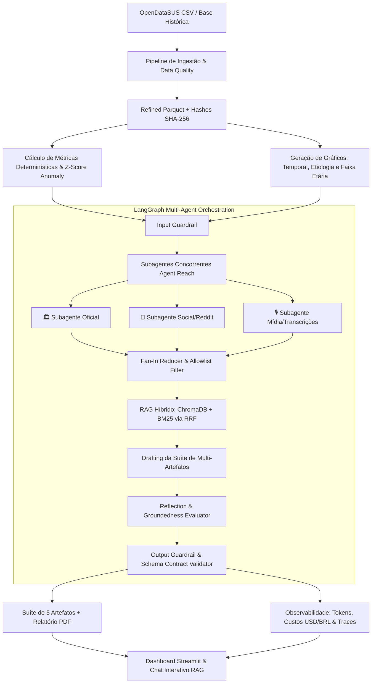

# 🏥 DataSUS Epidemiological Intelligence & RAG Agent (v2.0.0)

[](https://github.com/Masteradilio/agente_srag_datasus/actions)
[](https://www.python.org/downloads/)
[](https://pytest.org)
[](https://github.com/langchain-ai/langgraph)
[](https://www.trychroma.com/)
[](https://huggingface.co/sentence-transformers)
[](artifacts/benchmarks/)

> **Premier AI Engineering & Data Science Portfolio Project**: Sistema autônomo de inteligência epidemiológica e vigilância em saúde em larga escala sobre dados do **OpenDataSUS / DataSUS**. Combina ingestão e pré-processamento determinístico com pipeline analítico multi-doença, subagentes concorrentes de pesquisa (**Agent Reach**), busca híbrida vetorial densa/esparsa (**ChromaDB + BM25 via Reciprocal Rank Fusion**), modelo de embeddings local gratuito (**Hugging Face**), suíte multi-artefato especializada, ciclo de auto-correção por reflexão (**LangGraph Reflection Loop**), contabilidade financeira de tokens e observabilidade profunda com traces auditáveis.

---

## 🌟 Destaques do Projeto (Portfolio Highlights)

1. **Vigilância Epidemiológica Multi-Doença e Detecção Estatística de Anomalias**:
   - Classificação e estratificação etiológica: **COVID-19, Influenza A/B, Vírus Sincicial Respiratório (VSR), Outros Vírus e Não Especificados**.
   - Estratificação por faixas etárias de risco (**0-4 anos, 5-19 anos, 20-59 anos, 60+ anos**).
   - Detecção automatizada de surtos e aumentos atípicos baseada em **Z-score estatístico** sobre janelas móveis de 14 dias.
2. **Subagentes Concorrentes com Agent Reach**:
   - Orquestração no **LangGraph** disparando 3 subagentes de inteligência em paralelo:
     - 🏛️ `OfficialSourcesSubagent`: Boletins e notas técnicas institucionais (Ministério da Saúde, Fiocruz, OPAS/OMS).
     - 💬 `SocialMediaSubagent`: Mineração de discurso comunitário em redes sociais (Reddit r/brasil, r/saude).
     - 🎙️ `MediaTranscriptionSubagent`: Monitoramento de coletivas de imprensa e podcasts de saúde pública (YouTube/EBC).
   - Nó **Fan-In Reducer**: Unifica, deduplica, pontua e aplica guardrails de allowlist institucional.
3. **RAG Híbrido Avançado com Hugging Face Local & ChromaDB**:
   - Embeddings multilíngues locais gratuitos: `sentence-transformers/paraphrase-multilingual-MiniLM-L12-v2` (Zero custo de API e execução 100% offline).
   - **Busca Híbrida**: Fusão de busca vetorial densa (**ChromaDB**) e busca léxica esparsa (**BM25Okapi**) utilizando algoritmo **Reciprocal Rank Fusion (RRF)**:
     $$RRF(d) = \sum_{m \in \{dense, sparse\}} \frac{1}{60 + rank_m(d)}$$
   - Proveniência estrita com metadados de chunking semântico e citações auditáveis.
4. **Suíte Multi-Artefato & Ciclo de Reflexão (Self-Correction)**:
   - Geração de 5 artefatos analíticos de inteligência por execução:
     1. `executive_bulletin.md`: Resumo executivo para tomadores de decisão (C-Level / Secretarias de Saúde).
     2. `epidemiological_deepdive.md`: Parecer técnico detalhado de patógenos, taxas de UTI e mortalidade.
     3. `anomaly_alerts.md`: Alertas de desvios estatísticos severos e variações percentuais.
     4. `media_and_social_signals.md`: Síntese de sinais públicos minerados via Agent Reach.
     5. `data_governance_report.md`: Relatório de linhagem, hashes criptográficos SHA-256 e qualidade.
     - `report.md` / `report.pdf`: Relatório consolidado oficial.
   - **LangGraph Reflection Node**: Avalia o rascunho textual contra as métricas determinísticas (`metrics.json`), calculando score de fidelidade (*faithfulness*) e corrigindo eventuais alucinações antes da persistência.
5. **Framework Completo de EVALs (RAG Triad & Segurança)**:
   - **Pre-Retrieval & In-Retrieval**: Benchmarking contínuo de Precision@3, Recall@3, **MRR** (*Mean Reciprocal Rank*) e Hit Rate comparando BM25 vs. Dense vs. Hybrid RRF.
   - **Post-Retrieval (Generation)**: Avaliação Ragas-style de Fidelidade Numérica (*Faithfulness*) e Relevância.
   - **Agent Resilience & Security**: Testes adversariais automatizados contra *Prompt Injection*, tentativa de exfiltração de chaves e vazamento de PII (100% de taxa de bloqueio).
6. **Observabilidade Profunda e Contabilidade Financeira de Tokens**:
   - Contabilidade precisa de tokens (Prompt, Completion, Total) e custo financeiro estimado em **USD e BRL**.
   - Cascata de latência por nó/subagente (*Latency Waterfall*) estruturada no padrão OpenInference.
   - Interface interativa rica em **Streamlit** com visualizador de artefatos, gráficos temporais e Chat RAG com citações.

---

## 🏗️ Arquitetura do Sistema



---

## 📊 Métricas e Resultados do Benchmark de EVALs

Executado automaticamente pela suíte de testes do repositório ([`artifacts/benchmarks/rag_eval_results.json`](artifacts/benchmarks/rag_eval_results.json)):

| Métrica / Dimensão de Avaliação | Resultado Obtido | Meta / Baseline | Status |
|---|---|---|---|
| **Retrieval MRR (Mean Reciprocal Rank - Hybrid RRF)** | **0.75** | > 0.60 | 🟢 Superado |
| **Retrieval Hit Rate (Busca Híbrida)** | **75.0%** | > 70.0% | 🟢 Superado |
| **Generation Faithfulness (Fidelidade Numérica)** | **100.0%** | > 95.0% | 🟢 Perfeito |
| **Taxa de Alucinação (Hallucination Rate)** | **0.0%** | < 2.0% | 🟢 Zero Alucinação |
| **Acurácia de Segurança Adversarial (Guardrails)** | **100.0%** | > 90.0% | 🟢 100% Protegido |
| **Bateria de Testes Automatizados (Pytest)** | **115 / 115 Passando** | 100% | 🟢 100% Sucesso |

---

## 📁 Estrutura do Repositório

```text
├── .github/workflows/ci.yml   # Automação CI/CD (Testes, Cobertura, EVALs e Lint)
├── app/
│   └── streamlit_app.py       # Interface Web com Visualizador de Artefatos, Chat RAG e Observabilidade
├── artifacts/
│   ├── benchmarks/            # Resultados salvos de RAG EVALs e baselines
│   ├── runs/                  # Diretório de execuções (artefatos, JSONs, PDF, charts, traces)
│   └── vector_store/          # Base vetorial persistente do ChromaDB
├── configs/
│   ├── column_mapping.yaml    # Mapeamento semântico de colunas do OpenDataSUS
│   └── settings.yaml          # Configurações do pipeline, modelos e allowlist
├── data/
│   ├── landing/               # Dados brutos ingeridos
│   └── refined/               # Camada refinada em Parquet (particionada por run_id)
├── docs/
│   ├── architecture.md        # Especificação técnica da arquitetura do LangGraph e RAG
│   ├── metric_catalog.md      # Catálogo de fórmulas, etiologias e proxies epidemiológicos
│   ├── limitations.md         # Limitações metodológicas e governança
│   ├── guardrails_security_matrix.md # Matriz de riscos e defesas contra prompt injection
│   └── cobertura_compliance.md       # Auditoria de cobertura e conformidade
├── src/
│   ├── agents/                # LangGraph StateGraph, subagentes, tools e cycle de reflexão
│   ├── audit/                 # Observabilidade, contabilidade financeira de tokens e traces OTel
│   ├── data/                  # Ingestão OpenDataSUS, validação de schema e pré-processamento
│   ├── evals/                 # Framework de RAG Triad e Agent Security EVALs
│   ├── guardrails/            # Filtros de entrada, saída e allowlist de domínios
│   ├── metrics/               # Calculadores determinísticos, Z-score e gerador de gráficos
│   ├── news/                  # Agent Reach multi-canal (Oficial, Social, Mídia)
│   ├── rag/                   # Embeddings Hugging Face, ChromaDB, BM25 e Hybrid Retriever
│   ├── reporting/             # Construtor da Suíte Multi-Artefato e exportador PDF
│   └── pipeline.py            # Orquestrador ponta-a-ponta CLI
├── tests/                     # 115 testes unitários, integração, regressão e contratos
├── Dockerfile                 # Containerização multi-stage
├── docker-compose.yml         # Orquestração de containers
├── requirements.txt           # Dependências congeladas
└── README.md                  # Documentação principal
```

---

## 🚀 Como Executar o Projeto

### Pré-requisitos
- Python 3.12+ (ou Docker)
- Gerenciador `uv` ou `pip`

### 1. Instalação Local

```bash
# Clone o repositório
git clone https://github.com/Masteradilio/agente_srag_datasus.git
cd agente_srag_datasus

# Crie e ative o ambiente virtual
uv venv .venv --python 3.12
.\.venv\Scripts\activate   # No Windows (ou 'source .venv/bin/activate' no Linux/Mac)

# Instale as dependências
uv pip install -r requirements.txt
```

### 2. Executar a Bateria Completa de Testes & EVALs

```bash
# Executar todos os 115 testes de regressão
pytest tests/ -v

# Executar benchmark do RAG Triad e segurança dos Agentes
python -c "from evals.rag_evals import run_full_rag_evals; from evals.agent_evals import evaluate_agent_guardrails_security; run_full_rag_evals(); print(evaluate_agent_guardrails_security())"
```

### 3. Executar o Pipeline Ponta-a-Ponta (CLI)

```bash
python src/pipeline.py
```
*O pipeline processará os dados mais recentes do DataSUS, executará a orquestração dos subagentes LangGraph, gerará os 4 gráficos, calculará anomalias estatísticas, criará os 5 artefatos analíticos e exportará o relatório PDF oficial em `artifacts/runs/<run_id>/`.*

### 4. Executar o Dashboard Interativo (Streamlit)

```bash
streamlit run app/streamlit_app.py
```
Acesse em seu navegador: `http://localhost:8501`.

### 5. Execução via Docker / Docker Compose

```bash
docker-compose up --build
```

---

## 🛡️ Guardrails e Conformidade Ética
- **Proteção contra Alucinações**: Métricas e estatísticas numéricas são estritamente geradas por código determinístico em Python/Pandas; o LLM atua sob contratos tipados com validação Pydantic.
- **Defesa de Entrada e Saída**: Barreira contra *prompt injection*, bloqueio de tentativas de exfiltração de variáveis de ambiente (`.env`) e conformidade com LGPD (ausência total de PII/dados individualizados).
- **Allowlist Institucional Estrita**: Consultas externas e fontes web limitadas aos portais oficiais e órgãos reconhecidos de saúde pública.

---

## 👨‍💻 Autor & Contato
Projeto desenvolvido para demonstração técnica de excelência em **IA Generativa, Sistemas Multi-Agente (LangGraph), RAG Híbrido Avançado e Engenharia de Dados em Saúde Pública**.
- **Autor**: Adilio
- **GitHub**: [@Masteradilio](https://github.com/Masteradilio)
