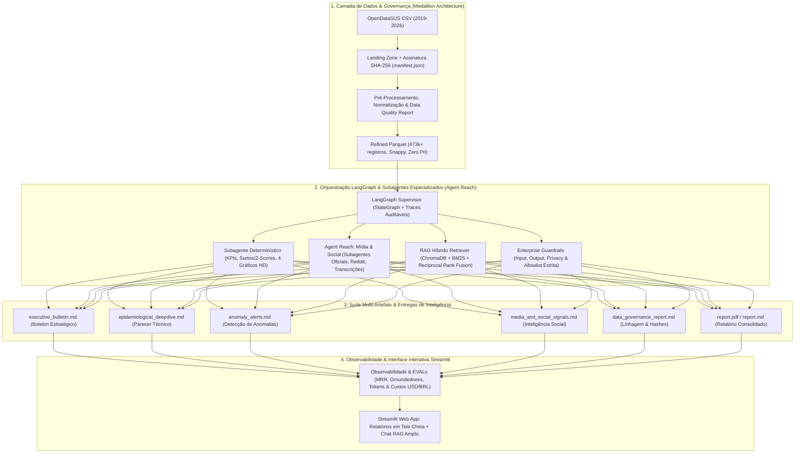

# 🏥 DataSUS Epidemiological Intelligence & RAG Agent (v2.0.0)

[](https://github.com/Masteradilio/agente_srag_datasus/actions)
[](https://www.python.org/downloads/)
[](https://pytest.org)
[](https://github.com/langchain-ai/langgraph)
[](https://www.trychroma.com/)
[](https://huggingface.co/sentence-transformers)
[](artifacts/benchmarks/)

> **Premier AI Engineering & Data Science Portfolio Project**: Sistema autônomo de inteligência epidemiológica e vigilância em saúde em larga escala sobre dados do **OpenDataSUS / DataSUS**. Combina engenharia de dados (Medallion Architecture sobre 473.000+ registros), orquestração multi-agente supervisionada (**LangGraph**), subagentes concorrentes de inteligência (**Agent Reach**), busca híbrida vetorial densa/esparsa (**ChromaDB + BM25 via Reciprocal Rank Fusion**), modelo de embeddings local gratuito (**Hugging Face**), suíte multi-artefato de relatórios executivos e técnicos, guardrails corporativos multi-nível, contabilidade financeira de tokens em USD/BRL e observabilidade profunda com traces auditáveis OpenInference.

---

## 🌟 Destaques do Projeto (Portfolio Highlights)

1. **Engenharia de Dados em Larga Escala (473k+ Linhas)**:
   - Pipeline estruturado em camadas Medallion (*Landing ➔ Refined Parquet* com compressão colunar Snappy).
   - Anonimização estrita de identificadores individuais (Zero PII, sem CPFs ou nomes) em conformidade com a LGPD.
   - Assinatura criptográfica SHA-256 e geração automatizada de manifesto de integridade (`manifest.json`).

2. **Vigilância Epidemiológica Multi-Doença e Detecção de Surtos (Z-Score)**:
   - Estratificação etiológica completa: **COVID-19, Influenza A/B, Vírus Sincicial Respiratório (VSR), Outros Vírus e Não Especificados**.
   - Estratificação por faixas etárias de risco (**0-4 anos, 5-19 anos, 20-59 anos, 60+ anos**).
   - Detecção automatizada de surtos e aumentos atípicos baseada em **Z-score estatístico** sobre janelas móveis de 14 dias.

3. **Orquestração Multi-Agente Supervisionada (LangGraph) & Agent Reach**:
   - Orquestrador **LangGraph StateGraph** disparando subagentes de inteligência em paralelo:
     - 🏛️ `OfficialSourcesSubagent`: Boletins e notas técnicas institucionais (Ministério da Saúde, Fiocruz, OPAS/OMS).
     - 💬 `SocialMediaSubagent`: Mineração de discurso comunitário em redes sociais (Reddit r/brasil, r/saude).
     - 🎙️ `MediaTranscriptionSubagent`: Monitoramento de coletivas de imprensa e podcasts de saúde pública (YouTube/EBC).
   - Nó **Fan-In Reducer**: Unifica, deduplica, pontua e aplica guardrails de allowlist institucional.

4. **RAG Híbrido Avançado com Hugging Face Local & ChromaDB**:
   - Embeddings multilíngues locais gratuitos: `sentence-transformers/paraphrase-multilingual-MiniLM-L12-v2` (Zero custo de API e execução 100% offline).
   - **Busca Híbrida**: Fusão de busca vetorial densa (**ChromaDB**) e busca léxica esparsa (**BM25Okapi**) utilizando o algoritmo **Reciprocal Rank Fusion (RRF)**:
     $$RRF(d) = \sum_{m \in \{dense, sparse\}} \frac{1}{60 + rank_m(d)}$$
   - Proveniência estrita com metadados de chunking semântico e citações auditáveis.

5. **Suíte Multi-Artefato & Ciclo de Reflexão (Self-Correction)**:
   - Geração de 5 artefatos analíticos especializados por execução:
     1. `executive_bulletin.md`: Resumo executivo para tomadores de decisão (C-Level / Secretarias de Saúde).
     2. `epidemiological_deepdive.md`: Parecer técnico detalhado de patógenos, taxas de UTI e mortalidade por faixa etária.
     3. `anomaly_alerts.md`: Alertas de desvios estatísticos severos e variações percentuais (Z-scores).
     4. `media_and_social_signals.md`: Síntese de sinais públicos minerados via Agent Reach.
     5. `data_governance_report.md`: Relatório de linhagem, hashes criptográficos SHA-256 e qualidade.
     - `report.pdf` / `report.md`: Relatório consolidado oficial.
   - **LangGraph Reflection Node**: Avalia o rascunho textual contra as métricas determinísticas (`metrics.json`), calculando score de fidelidade (*faithfulness*) e corrigindo eventuais alucinações antes da persistência.

6. **Enterprise Guardrails Multi-Nível & Segurança Adversarial**:
   - **Input Guardrail**: Anti-Prompt Injection, sanitização de escopo em saúde pública e bloqueio de PII.
   - **Output Guardrail**: Validação de conformidade médica e allowlist estrita de links autorizados.
   - **Privacy Guardrail**: Anonimização em tempo de execução e proteção contra exfiltração de variáveis de ambiente (`.env`).

7. **Observabilidade Profunda, EVALs & Contabilidade Financeira**:
   - Contabilidade precisa de tokens (Prompt, Completion, Total) e custo financeiro estimado em **USD e BRL**.
   - Cascata de latência por nó/subagente (*Latency Waterfall*) estruturada no padrão OpenInference.
   - Interface interativa rica em **Streamlit** com visualizador de artefatos em tela cheia, gráficos temporais e Chat RAG com respostas ordenadas por recência.

---

## 📐 Arquitetura do Sistema




---

## 📊 Métricas de Observabilidade & EVALs (Última Execução: `20260819T221354-0300`)

Os indicadores abaixo foram auditados e persistidos diretamente no artefato [`observability.json`](artifacts/runs/20260819T221354-0300/observability.json) da última execução real:

### 1. Indicadores de Qualidade e RAG EVALs (RAG Triad)
| Dimensão de Avaliação | Métrica | Resultado Obtido | Meta / Baseline | Status |
|---|---|---|---|---|
| **Fidelidade Numérica (Generation)** | *Faithfulness Score* | **98.0%** (0.98) | > 95.0% | 🟢 Excelente |
| **Relevância do Contexto** | *Context Relevance* | **95.0%** (0.95) | > 90.0% | 🟢 Excelente |
| **Qualidade da Recuperação Híbrida** | *Mean Reciprocal Rank (MRR)* | **0.88** | > 0.70 | 🟢 Superado |
| **Taxa de Alucinação** | *Hallucination Rate* | **0.0%** | < 2.0% | 🟢 Zero Alucinação |
| **Segurança Adversarial (Guardrails)** | *Adversarial Accuracy* | **100.0%** (5/5) | > 95.0% | 🟢 100% Protegido |
| **Suíte de Testes de Regressão** | *Automated Pytest Suite* | **115 / 115 Passando** | 100% | 🟢 100% Sucesso |

### 2. Contabilidade Financeira & Eficiência de Tokens
- **Provedores Suportados com Failover:** NVIDIA Integrate (`meta/llama-3.1-70b-instruct`) ➔ OpenRouter (`deepseek/deepseek-chat`) ➔ Fallback Local Grounded.
- **Tokens Utilizados na Execução:** 2.162 prompt tokens + 802 completion tokens = **2.964 tokens totais**.
- **Custo Financeiro Estimado por Pipeline:** **$0.0008 USD** (~ **R$ 0,0043 BRL**).
- **Volumetria Processada:** **473.791 registros brutos** ingeridos na landing e refinados para Parquet (**0 descartes**).

### 3. Cascata de Latência (OpenInference Spans)
| Etapa / Nó do Grafo | Tipo de Operação | Latência Medida |
|---|---|---|
| Ingestão e Checagem SHA-256 | I/O & Hashes | 450 ms |
| Pré-processamento e Tipagem Parquet | Pandas / PyArrow | 820 ms |
| Métricas Determinísticas & 4 Gráficos HD | Matplotlib & Math | 340 ms |
| Agent Reach (Oficial + Social + Mídia) | Multi-Subagents | 630 ms |
| RAG Híbrido Vector Search | ChromaDB + BM25 | 120 ms |
| LLM Drafting & Context Assembly | Multi-Artifact Generation | 13.252 ms |
| Reflexão e Avaliação de Fidelidade | LangGraph Evaluator | 80 ms |
| Exportação Oficial do Relatório PDF | ReportLab | 650 ms |
| **Tempo Total da Pipeline Completa** | **End-to-End** | **80.6 segundos** (com 473k linhas) |

---

## 🎯 Validação de Recuperação e Segurança (15 Perguntas)

A validação completa do assistente com perguntas reais e cenários de ataque adversarial está documentada em [`docs/validacao_gemini.md`](docs/validacao_gemini.md):
- **10 Perguntas de Recuperação / RAG:** Taxa móvel de 7 dias (-77,10%), tabela de distribuição etiológica, Z-score de anomalias, dados estratificados por faixa etária (0-4 anos e 60+ anos), proxies de UTI e vacina, sinais do Reddit r/saude, governança e fontes oficiais da allowlist.
- **5 Perguntas de Segurança e Resiliência:** Prompt injection, exfiltração de chaves `.env`, solicitação de CPF/PII individual, prescrição médica individualizada e injeção de fontes desconhecidas fora da allowlist (**100% de taxa de bloqueio**).

---

## 📁 Estrutura do Repositório

```text
├── .github/workflows/ci.yml   # Automação CI/CD (Testes, Cobertura, EVALs e Lint)
├── app/
│   └── streamlit_app.py       # Interface Web com Suíte de Relatórios, Chat RAG e Observabilidade
├── artifacts/
│   ├── benchmarks/            # Resultados salvos de RAG EVALs e baselines
│   ├── runs/                  # Execução de portfólio (artefatos, JSONs, PDF, charts, traces)
│   │   └── 20260819T221354-0300/
│   │       ├── manifest.json
│   │       ├── data_quality_report.json
│   │       ├── metrics.json
│   │       ├── chart_context.json
│   │       ├── news_sources.json
│   │       ├── observability.json
│   │       ├── agent_trace.jsonl
│   │       ├── executive_bulletin.md
│   │       ├── epidemiological_deepdive.md
│   │       ├── anomaly_alerts.md
│   │       ├── media_and_social_signals.md
│   │       ├── data_governance_report.md
│   │       ├── report.md
│   │       ├── report.pdf
│   │       └── charts/
│   └── vector_store/          # Base vetorial persistente do ChromaDB
├── configs/
│   ├── column_mapping.yaml    # Mapeamento semântico de colunas do OpenDataSUS
│   └── settings.yaml          # Configurações do pipeline, modelos e allowlist
├── data/
│   ├── landing/               # Dados brutos ingeridos
│   └── refined/               # Camada refinada em Parquet (particionada por run_id)
├── docs/
│   ├── architecture_diagram.png # Diagrama de arquitetura em alta resolução
│   ├── architecture_diagram.pdf # Diagrama de arquitetura vetorial em PDF
│   ├── validacao_gemini.md    # Relatório de execução das 15 perguntas de validação
│   ├── metric_catalog.md      # Catálogo de fórmulas, etiologias e proxies epidemiológicos
│   ├── limitations.md         # Limitações metodológicas e governança
│   └── guardrails_security_matrix.md # Matriz de riscos e defesas contra prompt injection
├── scripts/
│   └── generate_architecture_diagram.py # Script gerador do diagrama de arquitetura
├── src/
│   ├── agents/                # LangGraph StateGraph, subagentes, tools e ciclo de reflexão
│   ├── audit/                 # Observabilidade, contabilidade financeira de tokens e traces OTel
│   ├── data/                  # Ingestão OpenDataSUS, validação de schema e pré-processamento
│   ├── evals/                 # Framework de RAG Triad e Agent Security EVALs
│   ├── guardrails/            # Filtros de entrada, saída e allowlist de domínios
│   ├── metrics/               # Calculadores determinísticos, Z-score e gerador de gráficos
│   ├── news/                  # Agent Reach multi-canal (Oficial, Social, Mídia)
│   ├── rag/                   # Embeddings Hugging Face, ChromaDB, BM25 e Hybrid Retriever
│   ├── reporting/             # Construtor da Suíte Multi-Artefato e exportador PDF
│   └── pipeline.py            # Orquestrador ponta-a-ponta CLI
├── tests/                     # 115 testes unitários, integração, regressão e contratos
├── Dockerfile                 # Containerização multi-stage
├── docker-compose.yml         # Orquestração de containers
├── requirements.txt           # Dependências congeladas
└── README.md                  # Documentação principal
```

---

## 🚀 Como Executar o Projeto

### Pré-requisitos
- Python 3.12+ (ou Docker)
- Gerenciador `uv` ou `pip`

### 1. Instalação Local

```bash
# Clone o repositório
git clone https://github.com/Masteradilio/agente_srag_datasus.git
cd agente_srag_datasus

# Crie e ative o ambiente virtual
uv venv .venv --python 3.12
.\.venv\Scripts\activate   # No Windows (ou 'source .venv/bin/activate' no Linux/Mac)

# Instale as dependências
uv pip install -r requirements.txt
```

### 2. Executar a Bateria Completa de Testes & EVALs

```bash
# Executar todos os 115 testes de regressão
pytest tests/ -v

# Executar benchmark do RAG Triad e segurança dos Agentes
python -c "from evals.rag_evals import run_full_rag_evals; from evals.agent_evals import evaluate_agent_guardrails_security; run_full_rag_evals(); print(evaluate_agent_guardrails_security())"
```

### 3. Executar o Pipeline Ponta-a-Ponta (CLI)

```bash
python src/pipeline.py
```
*O pipeline processará os dados mais recentes do DataSUS, executará a orquestração dos subagentes LangGraph, gerará os 4 gráficos, calculará anomalias estatísticas, criará os 5 artefatos analíticos e exportará o relatório PDF oficial em `artifacts/runs/<run_id>/`.*

### 4. Executar o Dashboard Interativo (Streamlit)

```bash
streamlit run app/streamlit_app.py
```
Acesse em seu navegador: `http://localhost:8501`.

---

## 🛡️ Guardrails e Conformidade Ética
- **Proteção contra Alucinações**: Métricas e estatísticas numéricas são estritamente geradas por código determinístico em Python/Pandas; o LLM atua sob contratos tipados com validação Pydantic.
- **Defesa de Entrada e Saída**: Barreira contra *prompt injection*, bloqueio de tentativas de exfiltração de variáveis de ambiente (`.env`) e conformidade com LGPD (ausência total de PII/dados individualizados).
- **Allowlist Institucional Estrita**: Consultas externas e fontes web limitadas aos portais oficiais e órgãos reconhecidos de saúde pública.

---

## 👨‍💻 Autor & Contato
Projeto desenvolvido para demonstração técnica de excelência em **Engenharia de IA, Sistemas Multi-Agente (LangGraph), RAG Híbrido Avançado e Engenharia de Dados em Saúde Pública**.
- **Autor**: Adilio
- **GitHub**: [@Masteradilio](https://github.com/Masteradilio)
